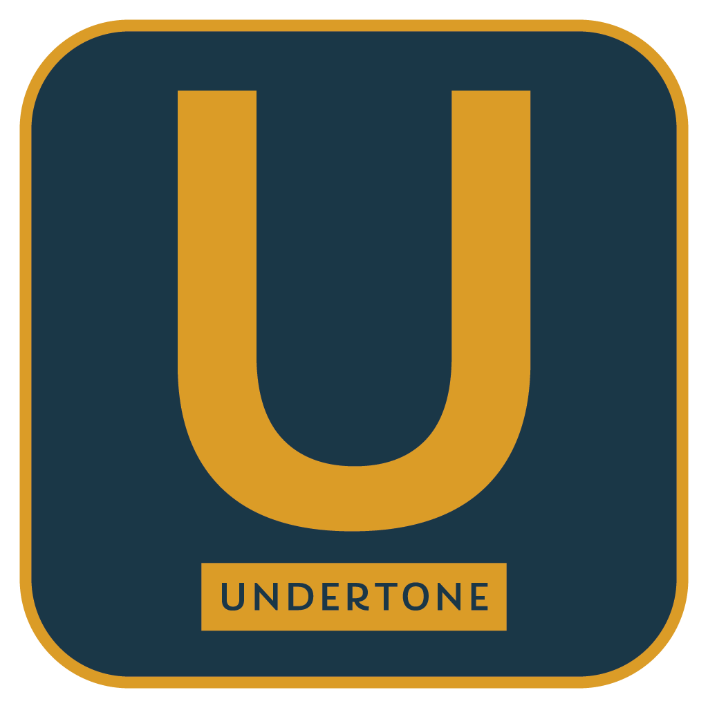

***TABLE OF CONTENTS***

<!-- TOC -->

- [1. Undertone](#1-undertone)
- [2. Key Features](#2-key-features)
  - [2.1. Voice Communication](#21-voice-communication)
  - [2.2. Text Communication](#22-text-communication)
  - [2.3. Control and Privacy](#23-control-and-privacy)
  - [2.4. Realtime Game Data and Extensibility](#24-realtime-game-data-and-extensibility)
- [3. Financing and Licensing](#3-financing-and-licensing)
  - [3.1. Undertone License 1.0](#31-undertone-license-10)
  - [3.2. Fancial Goals](#32-fancial-goals)
- [4. Contributing](#4-contributing)
- [5. Copyright and Ownership](#5-copyright-and-ownership)
- [6. Appendicies](#6-appendicies)

<!-- /TOC -->
# Undertone
Voice comms and community tools for serious gaming and roleplay. Undertone is designed to fill a niche in the gaming world where communities find them selves spread across many different solutions for voice, chat, scheduling and specialized tools used by roleplay and sim communities.3

# Key Features
These are some of  the key features that are planned for implementation, the list is not exaughstive and may not reflect the most current development plans.

## Voice Communication

The core of the software is supporting voice comms for everything from casual chat to specialized solutions for milsim and roleplay in games in FiveM, RedM, Flight Sims, Arma and more.

- [ ] Channel based voice chat for community and casual gaming  like you might find on Discord or TeamSpeak.
- [ ] World mode: positional 3D
- [ ] SubMix mode: Customizable voice channels used to simulate radios, cell phones and even supernatural telepathy, you control the effects and rules of how it is rendered.

## Text Communication

No community solution is complete without the ability to chat, make posts, and create announcements to keep your players in sync and engaged. All text chat is planned to support almost all of the MarkDown options and extensions like LaTeX and Mermaid.

- [ ] Text channels for persistent scrolling chat and live conversations.
- [ ] Forum channels for posting threads and organizing communications more effectively with stronger persistence for things like support and recruiting.
- [ ] Feed channels where you can use sources like a Text channel, rss feed or websocket and format them based on your own creative choices for display to the community.
- [ ] Events with server calendars, signups and reminders.

## Control and Privacy

One of the primary goals of Undertone was to provide communities with a tool that handles most of their needs and prevent facturing across multiple apps and platforms. A big advantage of that is controling where and how your information is stored as well having full control over your hosting and integrations.

- [ ] End to End encrytpion for all network traffic.
- [ ] Private data always stored with encryption in the database so you dont have to worry.
- [ ] Fully encrypted private chats with rotating keys so only those present when a message was written can decrypt it. No worries about snooping admins or data breaches for your personal chats.
- [ ] You choose your hosting platform whether that is at home or on the cloud, or next to your roleplay server for tight integration.

## Realtime Game Data and Extensibility

In order to serve different games, different communities and all the needs that fall in between the extremes, Undertone supports everal path ways for integration and capturing the data you need.

- [ ] Api for receiving data from the client via mods.
- [ ] Lua scripting to poll data from game API or server API.
- [ ] Highly configurable systems for parsing and tweaking data on the server to drive effects like radio distortion or reverb.

# Financing and Licensing

## Undertone License 1.0
Undertone and its parts are ***NOT*** offered under an `Open Source` license. Instead we use a custom `Source Available` license to control the rights  and usage of the software, as well as protect against competition and profiteering by commericial entities.  

Read the [LICENSE.md](LICENSE.md) to get the details.

For those not familiar `Source Available` indicates we will keep the source code visible and available to public, ensuring visibility and accountability.  We encourage contribution by individuals and permit communities to modify their version of Undertone to to suite their needs as long as they do not try to sell or compete with their version of the software.  

## Fancial Goals
No project is truly free. It is paid for with the effort, experience, time and ideas of the developers and community. While we begin the project as a small voulenteer team, the scope and vision for the future will require the ability to pay for developers time, resources and ensure the continued success and enhancement of Undertone. These are a few suggested solutions to help increase the viability of the project in the future:
- [ ] Rent cloud based servers (users may choose to forgoe the self hosting route and lease servers from Undertone for a reasonable fee)
- [ ] License ability to host for profit to other providers removing the hosting burden from Undertone while creating income streams from other companies.
- [ ] License Enterprise versions that support on-premises hosting for companies making more than a set monotary limit.  This would enable charging for the software without restricting usage or access to small companies and communities.
- [ ] Marketplace for visual enhancements and artist made icons/themes/backgrounds allowing users to earn money for their art while also helping to fund the project.  (This must be done without restricting the ability of normal users to use their own artworks as long as they possess the rights to the art). 

Longterm the idea is move ownership to a Non-Profit organization that owns and manages the project with the goal of providing a needed community service.

# Contributing

At this time we are still evaluating how we plan to take on contributors, but you will always be able to fork the repository and submit pull requests, or submit issues if you find a problem or have a great idea for a new feature.

# Copyright and Ownership

Undertone is the sole property of [Cephy314](https://github.com/Cephy314) aka Victoria Beauray Sagady.

Copyright © 2025, Victoria Beauray Sagady. All rights reserved.

# Appendicies
1. [Style Guide](docs/styleguide.md)
2. [Protocol Design](docs/protocol.md)

